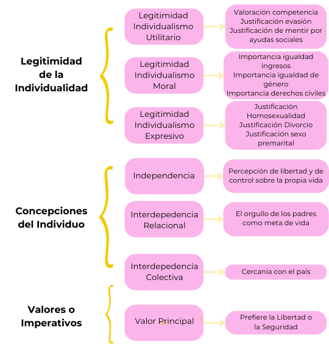

# Introducción

El presente trabajo busca explorar la relación entre los perfiles de individualismo y el apoyo a un líder fuerte en la sociedad chilena. En un contexto político que, tanto a nivel nacional como internacional, los liderazgos autoritarios y populistas cobran mayor relevancia, esta investigación se centró en entender como divergencias en los procesos de individuación pueden estar asociados con formas de ejercer el poder que se alejan del ideal democrático y representativo. De tal modo, se buscó arrojar luz sobre las consecuencias políticas del individualismo, en sus distintas expresiones. En particular, esta investigación se propuso como objetivo **establecer la relación entre el apoyo a un líder fuerte y los distintos perfiles de individualismo** en la sociedad chilena.

# Conceptos Claves

**Apoyo a un Líder Fuerte**: Se entenderá como la demanda, por parte de los ciudadanos, de que el poder político esté concentrado en un líder, quien lo ejerce de manera personalista, con poco o nulo contrapeso por parte de otras instituciones o actores. Pese a que este tipo de liderazgos se han considerado como más comunes en regímenes autoritarios [@kendall-taylor2017], durante las últimas décadas se ha observado su auge también en democracias liberales consolidadas [@lindstaedt2021; @kendall-taylor2017].

**Individualismo**: Se propone una conceptualización de individualismo que toma como base la Sociología del Individuo desarrollada por **Danilo Martuccelli** [-@martuccelli2010]. Se entenderá, pues, como los modelos de representación de la vida social que definen el rol del individuo en la sociedad. Bajo tales modelos, los individuos deben hacerse cargo de sus propias vidas en condiciones diversas de legitimidad de la acción individual, distintas representaciones culturales y autoconcepciones del individuo, y diferentes valores e imperativos estructuralmente producidos.

# Metodología

**Datos**: 7ma Ola de la Encuesta Mundial de Valores en Chile (2018)

**Variables**

-   *Variable Dependiente*: apoyo a un líder fuerte, medido a través de la valoración sobre qué tan bueno es *tener un líder fuerte que no se preocupe por el congreso y las elecciones*

-   *Variable Independiente*: individualismo, una variable latente y categórica que fue construida de manera inductiva a partir de un conjunto de indicadores operacionalizados en base a las 3 dimensiones que se desprenden de la definición del concepto: a) Legitimidad de la individualidad; b) concepciones del individuo; c) Valores principales. En la **Figura 1** se resumen los indicadores seleccionados

```{r, echo=FALSE, fig.cap= "Indicadores de Individualismo", out.width="100%", out.height="570px", fig.align='center'}



```

**Estrategia de Análisis**

-   Se realizó un **Análisis Descriptivo** para establecer los niveles de apoyo a un líder fuerte en el país.

-   A través de un **Análisis de Clases Latentes** (LCA) fue posible identificar de forma inductiva los perfiles de individualismo.

-   Cada caso fue asignado a un perfil según la probabilidad de pertenencia estimada por el modelo. De tal modo, se creó una variable categórica de individualismo. Esta nueva variable sirvió como predictor en una **Regresión Logística** con el fin de establecer su relación con el apoyo a un Líder Fuerte

# Resultados

El **44% de los chilenos considera que es bueno o muy bueno contar con un líder fuerte en el país**. Si bien esta cifra es baja a nivel latinoamericano, como se expone en la **Figura 2**, se observa un alza sostenida desde el año 2006 a nivel nacional.

```{r, echo=F, fig.cap= "Apoyo a Líder Fuerte en América (7ma Ola) y en Chile (1996-2018)", message=FALSE, fig.align="center", out.width="100%"}

library(patchwork)
library(tidyverse)
library(labelled)
library(broom)
library(gghighlight)

wvs <- readRDS("~/Downloads/WVS_Cross-National_Wave_7_Rds_v5_0.rds")

var_label(wvs$Q235) <- NULL

wvs$B_COUNTRY <- as_factor(wvs$B_COUNTRY)

wvs <- wvs %>% filter(Q235>0) %>%
  mutate(apoyo= ifelse(Q235==1|Q235==2, 1, 0))

p1 <- wvs %>%  
	filter(B_COUNTRY== "Argentina" |
				 B_COUNTRY== "Bolivia"|
				 B_COUNTRY== "Brazil"|
				 B_COUNTRY== "Canada"|
				 B_COUNTRY== "Colombia"|
				 B_COUNTRY== "Chile"|
				 B_COUNTRY== "Ecuador"|
				 B_COUNTRY== "Guatemala"|
				 B_COUNTRY== "Mexico"|
				 B_COUNTRY== "Nicaragua"|
				 B_COUNTRY== "Peru"|
				 B_COUNTRY== "Uruguay"|
				 B_COUNTRY== "United States"|
				 B_COUNTRY== "Venezuela") %>%
  group_by(B_COUNTRY) %>% summarise(apoyo=mean(apoyo)) %>%
  mutate(apoyo=apoyo*100) %>%
  ggplot(aes(x = reorder(B_COUNTRY, -apoyo), y = apoyo)) +
  geom_bar(stat = "identity", fill = "#F205b9") +
  labs(x = "Pais", y = "Apoyo (%)") + 
  geom_text(aes(label = sprintf("%.2f", apoyo)), hjust = 1.25, size = 4) +
  coord_flip() +
  theme_classic() +
  theme(axis.text.y= element_text(size=12),
        axis.title.x = element_text(size=12),
        axis.title.y= element_text(size=12),
        axis.text.x= element_text(size=12))

datosl <- readRDS("~/Downloads/WVS_TimeSeries_4_0.rds")

datoscl <- datosl %>% filter(S003==152)

datoscl <- datoscl %>% filter(E114>0) %>%
  mutate(apoyo= ifelse(E114==1|E114==2, 1, 0))


p2 <- datoscl %>% filter(S020!=1990) %>%
	group_by(S020) %>% summarise(apoyo=mean(apoyo)) %>%
  mutate(apoyo=apoyo*100,
         S020= factor(S020, levels= rev(unique(S020)))) %>%
  ggplot(aes(x = as.factor(S020), y = apoyo)) +
  geom_bar(stat = "identity", fill = "#F205B9") +
  labs(x = "Ola", y = "Apoyo (%)") + geom_text(aes(label = sprintf("%.2f", apoyo)), hjust = 1.25, size = 4) +
  coord_flip() +
  theme_classic()  +
  theme(axis.text.y= element_text(size=12),
        axis.title.x = element_text(size=12),
        axis.title.y= element_text(size=12),
        axis.text.x= element_text(size=12))

p1+p2

```

**Se identificó un modelo de 4 perfiles de individualismo**, siguiendo criterios estadísticos y teóricos (Parámetros Estimados = 71; $G^2$= 3016,5 (df=642); $AIC$=11.812; $BIC$=12.136). Las principales características de cada perfil se resumen en la **Figura 3** a continuación.

```{r, echo=F, fig.cap= "Modelo de Clases Latentes de Individualismo (4 clases)", fig.align='center', message=FALSE, out.width="100%"}

lca4 <- readRDS("ipo/output/lca4")

lca4_probs <- tidy(lca4) 

clase4 <- c("1" = "Individualismo Autoritario (29%)",
            "2" = "Individualismo Conservador (19%)",
            "3"= "Individualismo Liberal (27%)",
            "4"= "Individualismo Estratégico (25%)")

lca_fig <- lca4_probs %>% mutate(outcome= case_when(outcome==1 ~ "Nivel Alto",
                                         outcome==2 & variable!="Q27" & variable!="Q257" ~ "Nivel Bajo",
                                         outcome==2 & variable== "Q27" ~ "2",
                                         outcome==2 & variable== "Q257" ~ "2",
                                         outcome==3 & variable== "Q27" ~ "3",
                                         outcome==3 & variable== "Q257" ~ "3",
                                         outcome==4 & variable== "Q27" ~ "Nivel Bajo",
                                         outcome==4 & variable== "Q257" ~ "Nivel Bajo")) %>% ggplot(aes(x= fct_relevel(variable, "Q150",
                                         "Q257",
                                         "Q27",
                                         "Q48",
                                         "Q186",
                                         "Q185",
                                         "Q182",
                                         "Q249",
                                         "Q247",
                                         "Q246",
                                         "Q178",
                                         "Q177",
                                         "Q109"), 
                          y= estimate, fill= (factor(outcome, levels= c("Nivel Bajo",
                                                                         "3",
                                                                         "2",
                                                                         "Nivel Alto"))))) +
  geom_col() +
  facet_wrap(~class, nrow=2, labeller= labeller(class= clase4)) +
  coord_flip() +
  labs(x = "Indicadores",
       y = "Proporción",
       fill = "Categoría") +
  scale_x_discrete(labels=c("Libertad/Seguridad",
                                         "Colectiva",
                                         "Relacional",
                                         "Independencia",
                                         "Premarital",
                                         "Divorcio",
                                         "Homosexualidad",
                                         "Género",
                                         "Ingresos",
                                         "Derechos Civiles",
                                         "Evasión",
                                         "Beneficios",
                                         "Competencia")) +
  scale_fill_manual(values = c("#f205b9ff", "#f205b9bf", "#f205b980", "#f205b940"),
                    breaks= c("Nivel Alto", "2", "3", "Nivel Bajo")) +
  theme_classic() +
   theme(legend.position = "bottom",
         legend.text = element_text(size=12),
         legend.title = element_text(size=12),
         strip.text = element_text(size=12),
         axis.text.y = element_text(size=12),
         axis.text.x= element_text(size=12),
         axis.title.x= element_text(size=12),
         axis.title.y= element_text(size=12))

lca_fig
```

::: box
## Los 4 perfiles de Individualismo

El **Individualismo Autoritario** se caracteriza por su rechazo a la individualidad en todas las esferas. Muestra una clara preferencia por la seguridad por sobre la libertad (73%) y los niveles más bajos de independencia e interdepedencia colectiva. Solo el 14% tiene menos de 14 años y 48% pertenece a la clase trabajadora.

El **Individualismo Conservador** rechaza la individualidad en la esfera expresiva, pero muestra una alta legitimación de la individualidad en la esfera moral. 28% tiene más de 60 años, 67% son católicos y 36% se identifica con la centroderecha

El **Individualismo Liberal** demuestra una alta legitimación de la individualidad en las esferas expresiva y moral. Son el único grupo que prefiere la libertad por sobre la seguridad. 36% no tiene afiliación religiosa y un 37% pertenece a las clases intermedias

El **Individualismo Estratégico** es el único perfil que legitima la acción estratégica. Además, demuestran una alta legitimación de la individualidad en las esferas expresiva y moral. 28% tiene 30 años o menos.
:::

El nivel de apoyo a un Líder Fuerte es mayor entre los individualistas autoritarios y estratégicos (53% para ambos). Mediante una regresión logística se concluyó que, una vez controlado por las demás variables, **existe una asociación positiva y significativa entre ser un individualista autoritario** ($OR$=3,1; $p$\<0,001) **o estratégico** ($OR$=2,9; $p$\<0,001) y **el apoyo a un líder fuerte**.

Asimismo, **se observaron diferencias en la participación política entre perfiles**. Como se aprecia en la **Figura 4**, los perfiles de individualismo que reportaron menor participación en las elecciones presidenciales de 2017 se corresponden con aquellas que muestran un mayor apoyo a un líder fuerte.

```{r, echo=F, fig.cap="Perfiles de Individualismo por participación política", fig.align = 'center', out.width = '100%', message=FALSE}
datos <- readRDS("ipo/input/Datos/data.rds")

datos$Q222 <- factor(datos$Q222, levels = c(1,2,3), labels = c("Vota siempre",
                                                         "Vota a veces",
                                                         "Vota Nunca"))

datos$clase <- factor(datos$clase, levels = c(1,2,3,4), 
                      labels = c("Individualismo Autoritario",
                                 "Individualismo Conservador",
                                 "Individualismo Liberal",
                                 "Individualismo Estratégico"))

datos %>% filter(Q222!=is.na(Q222)) %>%
  group_by(clase, Q222) %>% summarise(prop=n()) %>%
  mutate(prop= prop/sum(prop)*100)  %>%
  ggplot(aes(x=clase, y=prop, fill= Q222)) +
  geom_bar(stat="identity", position="stack") +
  geom_text(aes(label = round(prop,2)), 
            position = position_stack(vjust = 0.5), 
            size = 4) +
  labs(x = "Clase", y = "Proporción", fill = "Participación") +
  scale_fill_manual(values = c("#f205b9ff", "#f205b980", "#f205b940")) +
  theme_classic() +
  theme(legend.position = "bottom",
        legend.text = element_text(size=12),
        axis.text.y= element_text(size=12),
        legend.title= element_text(size=12),
        axis.text.x= element_text(size=12),
        axis.title = element_text(size=12)) +
  coord_flip()
```

# Conclusiones

Los altos niveles de independencia, así como de interdependencia relacional y colectiva son **transversales a los 4 perfiles identificados**. Estas son características consistentes con la descripción del **Individualismo agéntico y el hiper-actor relacional** de **Araujo y Martuccelli** [-@araujo2020]. Con todo, el aporte de esta investigación es que fue posible observar cómo este modelo **diverge dentro de la sociedad chilena**. De tal modo, este enfoque permite apreciar los matices y las divergencias de los procesos de individuación en Chile.

Mientras dos de los perfiles muestran una asociación negativa con el apoyo a un líder fuerte (el conservador y el liberal), otros dos muestran una positiva (el estratégico y el autoritario). Esto se relaciona, además, con diferencias en la participación política. Se propone que a los primeros se les podría denominar como **individualismos cívicos**, mientras que a los segundos como **hiperindividualismos**

> Para los individualistas cívicos **la individualidad estaría vinculada a la pertenencia a la comunidad política.**

> Para los hiperindividualistas, **lo público aparece como un desafío**, un obstáculo que se debe evitar ya sea mediante la sumisión de la individualidad a un orden normativo o mediante la maximización de sus habilidades personales.

Aunque estos hallazgos son consistentes con aquellos que han indicado el mayor autoritarismo y conservadurismo de los nuevos votantes [@coes2023], cabe preguntarse si es la única explicación posible. Las características del Individualismo Estratégico no apuntan tanto a un mayor autoritarismo, sino a un **mayor pragmatismo en la esfera pública**, donde la autoridad política estaría sostenida por la eficiencia de los liderazgos para cumplir sus tareas [@araujo2022]. 

Esta investigación sugiere que la relación entre el individualismo y el apoyo a líderes fuertes es significativa, pero divergente entre distintos grupos: **Diferentes formas de individualismo se asociarían a la preferencia por distintas maneras de ejercer la autoridad**. Mientras que los individualistas cívicos parecen valorar una visión más representativa de la democracia, los hiperindividualistas favorecen un enfoque más pragmático y apático hacia la esfera pública. 